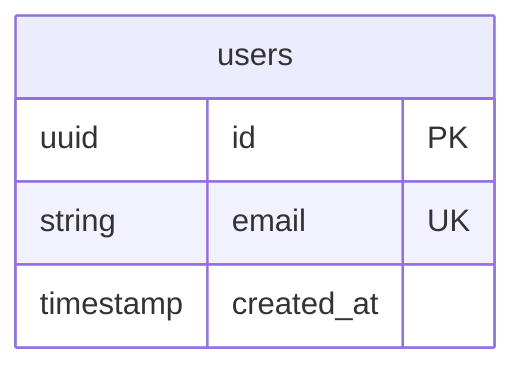

# Esquema de Base de Datos

**Base de datos:** Supabase (PostgreSQL)
**Última actualización:** 2026-03-17 19:58

---

## Diagrama ER



---

## Índice de Tablas

| # | Tabla | Descripción | RLS | Políticas |
|---|-------|-------------|-----|-----------|
| - | _(Se agregan conforme se crean tablas)_ | - | - | - |

---

## Tablas

> Las tablas se documentan aquí conforme se crean durante el desarrollo.

### Template para nuevas tablas:

<!--
### [nombre_tabla]

> [Descripción de la tabla]

| Columna | Tipo | Nullable | Default | Descripción |
|---------|------|----------|---------|-------------|
| `id` | `uuid` | NO | `gen_random_uuid()` | PK |

**Índices:**

| Nombre | Columnas | Tipo |
|--------|----------|------|
| `tabla_pkey` | `id` | PRIMARY KEY |

**Foreign Keys:**

| Columna | Referencia | On Delete |
|---------|------------|-----------|
| `user_id` | `auth.users(id)` | CASCADE |

**Políticas RLS:**

```sql
-- Descripción de la política
CREATE POLICY "nombre" ON tabla
    FOR SELECT USING (auth.uid() = user_id);
```

**Triggers:**

| Nombre | Evento | Función |
|--------|--------|---------|
| `on_updated` | BEFORE UPDATE | `handle_updated_at()` |
-->

---

## Historial de Migraciones

| # | Archivo | Fecha | Descripción | Estado |
|---|---------|-------|-------------|--------|
| - | _(Se agregan conforme se crean migraciones)_ | - | - | - |

---

## Funciones de Base de Datos

### handle_updated_at()
> Auto-actualiza `updated_at` en cada UPDATE.

```sql
CREATE OR REPLACE FUNCTION handle_updated_at()
RETURNS TRIGGER AS $$
BEGIN
  NEW.updated_at = NOW();
  RETURN NEW;
END;
$$ LANGUAGE plpgsql;
```

---

## Resumen RLS

| Tabla | SELECT | INSERT | UPDATE | DELETE |
|-------|--------|--------|--------|--------|
| _(Se actualiza conforme se crean tablas y políticas)_ | - | - | - | - |
