# Esquema de Base de Datos

**Base de datos:** Supabase (PostgreSQL)
**Última actualización:** 2026-03-25
**PRD de referencia:** `docs/ARKO_PRD_INSTAGRAM_v1.md`

---

## Acceso MCP disponible

La IA tiene acceso directo a Supabase vía MCP (`apps-y-dash`).

Esto significa que podés pedirle a la IA:
- consultar el schema real en tiempo real
- generar migraciones SQL precisas basadas en el estado actual de la DB
- verificar si una tabla o columna ya existe antes de crearla
- generar tipos TypeScript alineados al schema actual

**Regla:** los cambios siempre van por migraciones — nunca se ejecutan directo en production.
**Guía completa del MCP:** `docs/07-mcp-guide.md`

---

## Diagrama ER

```mermaid
erDiagram
    auth_users ||--|| profiles : has_profile
    auth_users ||--o{ workspaces : owns
    auth_users ||--o{ workspace_members : belongs_to
    workspaces ||--o{ workspace_members : has_members
    workspaces ||--o| meta_connections : has
    workspaces ||--o{ reels : contains
    workspaces ||--o{ reel_benchmarks : has
    workspaces ||--o{ chat_sessions : has
    workspaces ||--o{ sync_jobs : tracks
    workspaces ||--o{ audit_logs : logs
    reels ||--o| reel_metrics : has
    reels ||--o| reel_metrics_paid : has
    reels ||--o{ ad_mappings : mapped_to
    reels ||--o| reel_transcripts : has
    reels ||--o| reel_narrative_analysis : has
    reels ||--o| reel_visual_analysis : has
    reels ||--o| reel_audio_analysis : has
    reels ||--o{ reel_diagnostics : has
    reels ||--o{ reel_metrics_daily : has_daily_snapshots
    chat_sessions ||--o{ chat_messages : contains
    profiles ||--o{ invitations : invited_by
    workspaces ||--o| workspace_profile : has_profile
    workspaces ||--o{ workspace_strategies : has_strategies
    workspaces ||--o{ workspace_competitors : has_competitors
    workspaces ||--o| workspace_market : has_market
    workspaces ||--o{ workspace_references : has_references
    workspaces ||--o| workspace_brand : has_brand
```



---

## Índice de Tablas

| # | Tabla | Descripción | Migración | RLS |
|---|-------|-------------|-----------|-----|
| 0a | `profiles` | User extended data + roles (admin/user) | 000007 | ✅ |
| 0b | `workspace_members` | Many-to-many user ↔ workspace | 000007 | ✅ |
| 1 | `workspaces` | Multi-tenant root entity | 000001 | ✅ |
| 2 | `meta_connections` | OAuth tokens + Meta assets | 000002 | ✅ |
| 3 | `reels` | Reel base data (PRD 6.1) | 000003 | ✅ |
| 4 | `reel_metrics` | Organic metrics (PRD 6.2) | 000003, 000008 | ✅ |
| 5 | `reel_metrics_paid` | Paid metrics (PRD 6.2) | 000003 | ✅ |
| 6 | `ad_mappings` | Reel ↔ Ad mapping (PRD 5.2) | 000003 | ✅ |
| 7 | `reel_benchmarks` | 90-day benchmarks (PRD 6.4) — UPSERT, 1 row/workspace | 000003, 000011 | ✅ |
| 8 | `reel_transcripts` | ASR transcription (PRD 7.2) | 000004 | ✅ |
| 9 | `reel_narrative_analysis` | LLM narrative (PRD 7.3) | 000004 | ✅ |
| 10 | `reel_visual_analysis` | Visual frames (PRD 7.4) | 000004 | ✅ |
| 11 | `reel_audio_analysis` | Audio/delivery (PRD 7.5) | 000004 | ✅ |
| 12 | `reel_diagnostics` | On-demand AI diagnosis (PRD 9.3) | 000004 | ✅ |
| 13 | `chat_sessions` | Chat sessions (PRD 8.3) | 000005 | ✅ |
| 14 | `chat_messages` | Chat messages | 000005 | ✅ |
| 15 | `audit_logs` | AI response audit trail | 000005 | ✅ |
| 16 | `sync_jobs` | Sync job tracking | 000006 | ✅ |
| 17 | `ig_account_insights` | Daily account-level metrics (IG User Insights API) | 000009 | ✅ |
| 18 | `ig_account_demographics` | Lifetime audience demographics snapshots | 000009 | ✅ |
| 19 | `reel_metrics_daily` | Daily snapshots of per-reel metrics for time-series charts | 000012 | ✅ |
| 20 | `invitations` | Invitation-only registration tokens | 000015 | ✅ |
| 21 | `workspace_profile` | Business description, brand persona, target audience | 000015 | ✅ |
| 22 | `workspace_strategies` | Content strategy per platform | 000015 | ✅ |
| 23 | `workspace_competitors` | Competitor analysis + scraped data | 000015 | ✅ |
| 24 | `workspace_market` | Industry state, trends, beliefs | 000015 | ✅ |
| 25 | `workspace_references` | Brand references/inspiration | 000015 | ✅ |
| 26 | `workspace_brand` | Niche language, tools, mechanisms | 000015 | ✅ |

**Views:**
| View | Descripción |
|------|-------------|
| `reel_computed` | Views totales, ratios derivados, retention_ratio (PRD 6.2-6.3) |

---

## Tablas

### profiles
> Extended user data. Auto-created on signup via `handle_new_user()` trigger. 1:1 con auth.users.

| Columna | Tipo | Nullable | Default | Descripción |
|---------|------|----------|---------|-------------|
| `id` | uuid PK | NO | — | FK → auth.users(id) ON DELETE CASCADE |
| `email` | text | NO | — | Email del usuario |
| `full_name` | text | SÍ | — | Nombre completo |
| `avatar_url` | text | SÍ | — | URL del avatar |
| `role` | text | NO | 'user' | 'admin' o 'user' |
| `is_active` | boolean | NO | true | Estado activo |
| `last_sign_in_at` | timestamptz | SÍ | — | Último login |
| `created_at` | timestamptz | NO | now() | — |
| `updated_at` | timestamptz | NO | now() | — |

**RLS:** Users ven su propio perfil. Admin ve todos. Service role puede insertar.
**Trigger:** `handle_new_user()` — al registrarse un usuario, crea automáticamente: (1) profile con role='admin' si email = emendoza@ainnovateagency.com, (2) un workspace default, (3) un workspace_member con role='owner'. Actualizado en migración 000010.

### workspace_members
> Many-to-many entre users y workspaces. Soporta roles por workspace.

| Columna | Tipo | Nullable | Default | Descripción |
|---------|------|----------|---------|-------------|
| `id` | uuid PK | NO | gen_random_uuid() | — |
| `workspace_id` | uuid FK | NO | — | FK → workspaces(id) |
| `user_id` | uuid FK | NO | — | FK → auth.users(id) |
| `role` | text | NO | 'member' | 'owner', 'admin', 'member', 'viewer' |
| `invited_by` | uuid FK | SÍ | — | FK → auth.users(id) |
| `joined_at` | timestamptz | NO | now() | — |
| `created_at` | timestamptz | NO | now() | — |

**Unique:** (workspace_id, user_id)
**RLS:** Users ven sus membresías. Owners + admins pueden insertar/eliminar.

### workspaces
> Multi-tenant root entity. Cada workspace = una marca/creador.

| Columna | Tipo | Nullable | Default | Descripción |
|---------|------|----------|---------|-------------|
| `id` | uuid | NO | `gen_random_uuid()` | PK |
| `owner_id` | uuid | NO | — | FK → auth.users |
| `name` | text | NO | — | Nombre del workspace |
| `slug` | text | NO | — | URL slug (UNIQUE) |
| `plan` | text | NO | `'pro'` | Siempre 'pro' (único plan) |
| `reels_limit` | int | NO | 10 | Límite de reels por plan |
| `is_active` | boolean | NO | true | — |
| `settings` | jsonb | NO | `'{}'` | Config extra |
| `created_at` | timestamptz | NO | `now()` | — |
| `updated_at` | timestamptz | NO | `now()` | — |

### meta_connections
> OAuth tokens y assets de Meta (PRD 4.1-4.6).

| Columna | Tipo | Nullable | Default | Descripción |
|---------|------|----------|---------|-------------|
| `id` | uuid | NO | `gen_random_uuid()` | PK |
| `workspace_id` | uuid | NO | — | FK → workspaces (UNIQUE) |
| `access_token_encrypted` | bytea | SI | — | Token encriptado con pgcrypto |
| `token_expires_at` | timestamptz | SI | — | Expiración del token |
| `fb_user_id` | text | SI | — | Facebook user ID |
| `page_id` | text | SI | — | Facebook Page ID |
| `ig_business_account_id` | text | SI | — | IG Business Account ID |
| `ig_username` | text | SI | — | Username de Instagram |
| `ad_account_ids` | text[] | SI | `'{}'` | Ad Account IDs activos |
| `permissions_granted` | text[] | SI | `'{}'` | Permisos OAuth otorgados |
| `status` | text | NO | `'pending'` | pending/active/expired/revoked/error |

### reels
> Datos base de cada Reel (PRD 6.1).

| Columna | Tipo | Nullable | Default | Descripción |
|---------|------|----------|---------|-------------|
| `id` | uuid | NO | `gen_random_uuid()` | PK |
| `workspace_id` | uuid | NO | — | FK → workspaces |
| `ig_media_id` | text | NO | — | ID de IG Graph API |
| `caption` | text | SI | — | Caption del Reel |
| `permalink` | text | SI | — | URL permanente |
| `thumbnail_url` | text | SI | — | URL del thumbnail |
| `published_at` | timestamptz | SI | — | Fecha de publicación |
| `duration_seconds` | real | SI | — | Duración en segundos |
| `reel_type` | text | NO | `'unknown'` | normal/trial_likely/unknown (PRD 2.3) |
| `has_ads` | boolean | NO | false | Si tiene ads asociados |
| `attribution_confidence` | text | NO | `'none'` | none/low/medium/high (PRD 2.4) |
| `sync_status` | text | NO | `'synced'` | synced/processing/analyzed/error |

### reel_metrics / reel_metrics_paid / ad_mappings / reel_benchmarks
> Ver detalle completo en migraciones `20260318000003_reels_and_metrics.sql`

`reel_metrics` cuenta además con la migración `20260318000008_reel_metrics_extended_watch_time.sql`, que agrega `watch_time_total_sec` para persistir el tiempo total de visualización cuando se aplique en la base de datos.

### reel_transcripts / reel_narrative_analysis / reel_visual_analysis / reel_audio_analysis / reel_diagnostics
> Ver detalle completo en migraciones `20260318000004_ai_pipeline.sql`

### chat_sessions / chat_messages / audit_logs
> Ver detalle completo en migraciones `20260318000005_chat.sql`

### sync_jobs
> Ver detalle completo en migración `20260318000006_sync_and_rls.sql`

### reel_metrics_daily
> Daily snapshots de métricas por reel para gráficas de evolución temporal. Diseñada para escalar a 100+ usuarios.

| Columna | Tipo | Nullable | Default | Descripción |
|---------|------|----------|---------|-------------|
| `id` | uuid PK | NO | gen_random_uuid() | — |
| `reel_id` | uuid FK | NO | — | FK → reels(id) ON DELETE CASCADE |
| `workspace_id` | uuid FK | NO | — | FK → workspaces(id) ON DELETE CASCADE |
| `metric_date` | date | NO | — | Fecha del snapshot |
| `views_org` | bigint | SÍ | 0 | Views orgánicas acumuladas |
| `reach_org` | bigint | SÍ | 0 | Alcance orgánico |
| `impressions_org` | bigint | SÍ | 0 | Impresiones orgánicas |
| `likes_total` | bigint | SÍ | 0 | Likes totales |
| `comments_total` | bigint | SÍ | 0 | Comentarios totales |
| `shares_total` | bigint | SÍ | 0 | Compartidos totales |
| `saves_total` | bigint | SÍ | 0 | Guardados totales |
| `total_interactions` | bigint | SÍ | 0 | Interacciones totales |
| `avg_watch_time_sec` | real | SÍ | — | Tiempo promedio de visualización (s) |
| `views_paid` | bigint | SÍ | 0 | Views pagas |
| `impressions_paid` | bigint | SÍ | 0 | Impresiones pagas |
| `reach_paid` | bigint | SÍ | 0 | Alcance pago |
| `spend_cents` | bigint | SÍ | 0 | Gasto en centavos |
| `fetched_at` | timestamptz | NO | now() | Última actualización |
| `created_at` | timestamptz | NO | now() | — |

**UNIQUE:** (reel_id, metric_date)
**Índices:** `(workspace_id, metric_date DESC)`, `(reel_id, metric_date DESC)`
**RLS:** SELECT/INSERT/UPDATE via is_workspace_member(workspace_id)

### invitations
> Invitation-only registration. Admin creates invitation → token generated → user registers with link.

| Columna | Tipo | Nullable | Default | Descripción |
|---------|------|----------|---------|-------------|
| `id` | uuid PK | NO | gen_random_uuid() | — |
| `email` | text | NO | — | Email del invitado |
| `token` | uuid UNIQUE | NO | gen_random_uuid() | Token para el link de invitación |
| `status` | text | NO | 'pending' | pending/used/expired |
| `invited_by` | uuid FK | NO | — | FK → profiles(id) |
| `workspace_id` | uuid FK | SÍ | — | FK → workspaces(id), workspace pre-asignado |
| `used_by` | uuid FK | SÍ | — | FK → auth.users(id), usuario que usó la invitación |
| `used_at` | timestamptz | SÍ | — | Fecha de uso |
| `expires_at` | timestamptz | NO | now() + 7 days | Expiración |
| `created_at` | timestamptz | NO | now() | — |

**Índices:** `token` (UNIQUE), `(email, status)`, `(status) WHERE status = 'pending'`
**RLS:** Solo admins (role='admin' en profiles) pueden SELECT/INSERT/UPDATE.
**Trigger:** `handle_new_user()` busca invitación pendiente por email y la marca como used.

### workspace_profile
> Business context for AI analysis. One per workspace.

| Columna | Tipo | Nullable | Default | Descripción |
|---------|------|----------|---------|-------------|
| `id` | uuid PK | NO | gen_random_uuid() | — |
| `workspace_id` | uuid FK UNIQUE | NO | — | FK → workspaces(id) ON DELETE CASCADE |
| `business_description` | text | SÍ | — | Descripción del negocio |
| `brand_persona` | text | SÍ | — | Personalidad de marca |
| `avatar_description` | text | SÍ | — | Descripción del avatar/personaje |
| `main_offer` | text | SÍ | — | Oferta principal |
| `target_audience` | text | SÍ | — | Audiencia objetivo |
| `created_at` | timestamptz | NO | now() | — |
| `updated_at` | timestamptz | NO | now() | — |

**RLS:** via is_workspace_member(workspace_id)

### workspace_strategies
> Content strategy per platform. Multiple rows per workspace.

| Columna | Tipo | Nullable | Default | Descripción |
|---------|------|----------|---------|-------------|
| `id` | uuid PK | NO | gen_random_uuid() | — |
| `workspace_id` | uuid FK | NO | — | FK → workspaces(id) ON DELETE CASCADE |
| `platform` | text | NO | 'instagram' | instagram/youtube/tiktok/other |
| `what_tested` | text | SÍ | — | Qué se ha testeado |
| `test_results` | text | SÍ | — | Resultados de tests |
| `conclusions` | text | SÍ | — | Conclusiones |
| `current_strategy` | text | SÍ | — | Estrategia actual |
| `formats_and_quantity` | text | SÍ | — | Formatos y cantidad |
| `why_it_will_work` | text | SÍ | — | Por qué funcionará |
| `created_at` | timestamptz | NO | now() | — |
| `updated_at` | timestamptz | NO | now() | — |

**UNIQUE:** (workspace_id, platform)
**RLS:** via is_workspace_member(workspace_id)

### workspace_competitors
> Competitor profiles for analysis. Multiple per workspace.

| Columna | Tipo | Nullable | Default | Descripción |
|---------|------|----------|---------|-------------|
| `id` | uuid PK | NO | gen_random_uuid() | — |
| `workspace_id` | uuid FK | NO | — | FK → workspaces(id) ON DELETE CASCADE |
| `name` | text | SÍ | — | Nombre del competidor |
| `ig_url` | text | SÍ | — | URL de Instagram |
| `why_better` | text | SÍ | — | Por qué son mejores |
| `scraped_data` | jsonb | NO | '{}' | Datos scrapeados |
| `last_scraped_at` | timestamptz | SÍ | — | Última fecha de scraping |
| `created_at` | timestamptz | NO | now() | — |

**RLS:** via is_workspace_member(workspace_id)

### workspace_market
> Market analysis context. One per workspace.

| Columna | Tipo | Nullable | Default | Descripción |
|---------|------|----------|---------|-------------|
| `id` | uuid PK | NO | gen_random_uuid() | — |
| `workspace_id` | uuid FK UNIQUE | NO | — | FK → workspaces(id) ON DELETE CASCADE |
| `industry_state` | text | SÍ | — | Estado de la industria |
| `audience_exposure` | text | SÍ | — | Exposición de la audiencia |
| `market_beliefs` | text | SÍ | — | Creencias del mercado |
| `burned_topics` | text | SÍ | — | Temas quemados |
| `current_trends` | text | SÍ | — | Tendencias actuales |
| `competitiveness` | text | SÍ | — | Nivel de competitividad |
| `differentiator` | text | SÍ | — | Diferenciador |
| `created_at` | timestamptz | NO | now() | — |
| `updated_at` | timestamptz | NO | now() | — |

**RLS:** via is_workspace_member(workspace_id)

### workspace_references
> Brand references/inspiration. Multiple per workspace.

| Columna | Tipo | Nullable | Default | Descripción |
|---------|------|----------|---------|-------------|
| `id` | uuid PK | NO | gen_random_uuid() | — |
| `workspace_id` | uuid FK | NO | — | FK → workspaces(id) ON DELETE CASCADE |
| `brand_name` | text | SÍ | — | Nombre de la marca |
| `brand_url` | text | SÍ | — | URL de la marca |
| `what_they_like` | text | SÍ | — | Qué les gusta |
| `created_at` | timestamptz | NO | now() | — |

**RLS:** via is_workspace_member(workspace_id)

### workspace_brand
> Brand-specific niche language and mechanisms. One per workspace.

| Columna | Tipo | Nullable | Default | Descripción |
|---------|------|----------|---------|-------------|
| `id` | uuid PK | NO | gen_random_uuid() | — |
| `workspace_id` | uuid FK UNIQUE | NO | — | FK → workspaces(id) ON DELETE CASCADE |
| `why_clients_choose` | text | SÍ | — | Por qué los clientes eligen |
| `niche_language` | text | SÍ | — | Lenguaje del nicho |
| `niche_tools` | text | SÍ | — | Herramientas del nicho |
| `filtering_words` | text | SÍ | — | Palabras de filtrado |
| `new_mechanisms` | text | SÍ | — | Nuevos mecanismos |
| `created_at` | timestamptz | NO | now() | — |
| `updated_at` | timestamptz | NO | now() | — |

**RLS:** via is_workspace_member(workspace_id)

---

## Historial de Migraciones

| # | Archivo | Fecha | Descripción |
|---|---------|-------|-------------|
| 1 | `20260318000001_core_infrastructure.sql` | 2026-03-18 | pgcrypto, handle_updated_at(), workspaces |
| 2 | `20260318000002_meta_connections.sql` | 2026-03-18 | Meta OAuth connections |
| 3 | `20260318000003_reels_and_metrics.sql` | 2026-03-18 | reels, reel_metrics, reel_metrics_paid, ad_mappings, reel_benchmarks, reel_computed view |
| 4 | `20260318000004_ai_pipeline.sql` | 2026-03-18 | reel_transcripts, reel_narrative/visual/audio_analysis, reel_diagnostics |
| 5 | `20260318000005_chat.sql` | 2026-03-18 | chat_sessions, chat_messages, audit_logs |
| 6 | `20260318000006_sync_and_rls.sql` | 2026-03-18 | sync_jobs, RLS policies (all tables), storage buckets |
| 8 | `20260318000008_reel_metrics_extended_watch_time.sql` | 2026-03-18 | `watch_time_total_sec` en `reel_metrics` |
| 9 | `20260318000009_ig_account_insights.sql` | 2026-03-18 | ig_account_insights (daily metrics), ig_account_demographics (lifetime demographics) |
| 10 | `20260323000010_auto_create_workspace_on_signup.sql` | 2026-03-23 | Actualiza handle_new_user() para auto-crear workspace + workspace_member al signup. Backfill de usuarios existentes. |
| 11 | `20260323000011_benchmark_extended_metrics_upsert.sql` | 2026-03-23 | Agrega avg_engagement_rate, avg_retention_rate, avg_duration_seconds, avg_reach_per_view, avg_saves_per_reach a reel_benchmarks. UNIQUE(workspace_id) + UPDATE RLS para UPSERT. |
| 12 | `20260323000012_reel_metrics_daily.sql` | 2026-03-23 | reel_metrics_daily para snapshots diarios de métricas por reel. Índices compuestos + RLS. |
| 14 | `20260324000014_pg_cron_scheduled_sync.sql` | 2026-03-24 | pg_cron + pg_net + `trigger_scheduled_sync()` para sync automático cada 6h. |
| 15 | `20260325000015_invitations_and_onboarding.sql` | 2026-03-25 | invitations (admin-only RLS), validate_invitation() RPC, updated handle_new_user() con invitation lookup, 6 tablas de onboarding (workspace_profile, workspace_strategies, workspace_competitors, workspace_market, workspace_references, workspace_brand). |
| 16 | `20260325000016_fix_profiles_admin_rls_recursion.sql` | 2026-03-25 | `is_admin()` SECURITY DEFINER function, fix RLS recursion in profiles, updated invitations policies, workspace plan default → 'pro', admin can view all workspaces + meta_connections. |

---

## Funciones de Base de Datos

### trigger_scheduled_sync()
> Función invocada por `pg_cron` cada 6 horas. Itera workspaces con conexión Meta activa y dispara HTTP POST a la Edge Function `sync-instagram` vía `pg_net`. SYNC_SECRET se obtiene de Supabase Vault.

```sql
-- Schedule: 0 */6 * * * (cada 6 horas)
-- Probar manualmente: SELECT public.trigger_scheduled_sync();
-- Ver cron jobs: SELECT * FROM cron.job;
```

### handle_new_user()
> Trigger on `auth.users` AFTER INSERT. Crea profile + workspace + workspace_member + procesa invitación automáticamente al registrarse.

```sql
CREATE OR REPLACE FUNCTION handle_new_user()
RETURNS TRIGGER AS $$
-- 1) Crea profile (con role='admin' si es emendoza@ainnovateagency.com)
-- 2) Crea workspace default ("{nombre}'s Workspace")
-- 3) Crea workspace_member con role='owner'
-- 4) Busca invitación pendiente por email → marca como used (status='used', used_by, used_at)
$$ LANGUAGE plpgsql SECURITY DEFINER;
```

### validate_invitation(p_token uuid)
> SECURITY DEFINER RPC. Allows anon users to validate an invitation token without direct table access.

```sql
CREATE OR REPLACE FUNCTION validate_invitation(p_token uuid)
RETURNS TABLE(valid boolean, email text, invitation_id uuid) AS $$
-- Returns {valid: true, email, invitation_id} if token is pending and not expired
-- Returns {valid: false} otherwise
$$ LANGUAGE plpgsql SECURITY DEFINER;
```

### handle_updated_at()
> Auto-actualiza `updated_at` en cada UPDATE.

```sql
CREATE OR REPLACE FUNCTION handle_updated_at()
RETURNS TRIGGER AS $$
BEGIN
  NEW.updated_at = NOW();
  RETURN NEW;
END;
$$ LANGUAGE plpgsql;
```

### is_admin()
> SECURITY DEFINER function to check if the authenticated user is an admin. Bypasses RLS to avoid infinite recursion when used in policies on the `profiles` table. Used by admin RLS policies on profiles, invitations, workspaces, and meta_connections.

```sql
CREATE OR REPLACE FUNCTION public.is_admin()
RETURNS boolean
LANGUAGE sql SECURITY DEFINER STABLE
SET search_path = ''
AS $$
  SELECT EXISTS (
    SELECT 1 FROM public.profiles
    WHERE id = auth.uid() AND role = 'admin'
  );
$$;
```

### is_workspace_member(ws_id uuid)
> Verifica si el usuario autenticado es owner del workspace. Usada por todas las RLS policies.

```sql
CREATE OR REPLACE FUNCTION is_workspace_member(ws_id uuid)
RETURNS boolean AS $$
BEGIN
  RETURN EXISTS (
    SELECT 1 FROM workspaces
    WHERE id = ws_id AND owner_id = auth.uid()
  );
END;
$$ LANGUAGE plpgsql SECURITY DEFINER STABLE;
```

---

## Resumen RLS

| Tabla | SELECT | INSERT | UPDATE | DELETE |
|-------|--------|--------|--------|--------|
| `workspaces` | owner_id = auth.uid() OR is_admin() | owner_id = auth.uid() | owner_id = auth.uid() | owner_id = auth.uid() |
| `meta_connections` | is_workspace_member OR is_admin() | is_workspace_member | is_workspace_member | is_workspace_member |
| `reels` | is_workspace_member | is_workspace_member | is_workspace_member | is_workspace_member |
| `reel_metrics` | is_workspace_member | is_workspace_member | is_workspace_member | — |
| `reel_metrics_paid` | is_workspace_member | is_workspace_member | is_workspace_member | — |
| `ad_mappings` | is_workspace_member | is_workspace_member | is_workspace_member | — |
| `reel_benchmarks` | is_workspace_member | is_workspace_member | is_workspace_member | — |
| `reel_transcripts` | is_workspace_member | is_workspace_member | is_workspace_member | — |
| `reel_narrative_analysis` | is_workspace_member | is_workspace_member | is_workspace_member | — |
| `reel_visual_analysis` | is_workspace_member | is_workspace_member | is_workspace_member | — |
| `reel_audio_analysis` | is_workspace_member | is_workspace_member | is_workspace_member | — |
| `reel_diagnostics` | is_workspace_member | is_workspace_member | — | — |
| `chat_sessions` | is_workspace_member | is_workspace_member | is_workspace_member | is_workspace_member |
| `chat_messages` | is_workspace_member | is_workspace_member | — | — |
| `audit_logs` | is_workspace_member | is_workspace_member | — | — |
| `sync_jobs` | is_workspace_member | is_workspace_member | is_workspace_member | — |
| `reel_metrics_daily` | is_workspace_member | is_workspace_member | is_workspace_member | — |
| `invitations` | admin only | admin only | admin only | — |
| `workspace_profile` | is_workspace_member | is_workspace_member | is_workspace_member | is_workspace_member |
| `workspace_strategies` | is_workspace_member | is_workspace_member | is_workspace_member | is_workspace_member |
| `workspace_competitors` | is_workspace_member | is_workspace_member | is_workspace_member | is_workspace_member |
| `workspace_market` | is_workspace_member | is_workspace_member | is_workspace_member | is_workspace_member |
| `workspace_references` | is_workspace_member | is_workspace_member | is_workspace_member | is_workspace_member |
| `workspace_brand` | is_workspace_member | is_workspace_member | is_workspace_member | is_workspace_member |

## Storage Buckets

| Bucket | Público | Uso |
|--------|---------|-----|
| `reels-media` | No | MP4 descargados de Reels |
| `reels-frames` | No | Frames extraídos para análisis visual |
