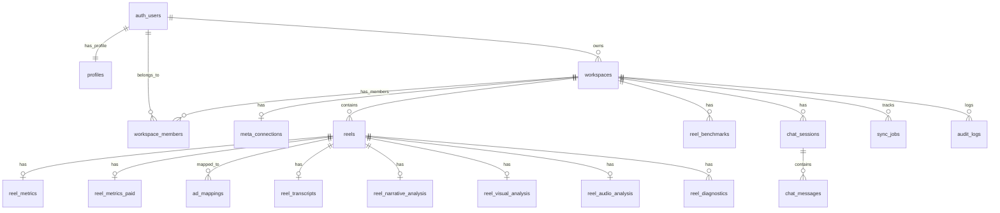

# Esquema de Base de Datos

**Base de datos:** Supabase (PostgreSQL)
**Última actualización:** 2026-03-18 01:00
**PRD de referencia:** `docs/ARKO_PRD_INSTAGRAM_v1.md`

---

## Diagrama ER



---

## Índice de Tablas

| # | Tabla | Descripción | Migración | RLS |
|---|-------|-------------|-----------|-----|
| 0a | `profiles` | User extended data + roles (admin/user) | 000007 | ✅ |
| 0b | `workspace_members` | Many-to-many user ↔ workspace | 000007 | ✅ |
| 1 | `workspaces` | Multi-tenant root entity | 000001 | ✅ |
| 2 | `meta_connections` | OAuth tokens + Meta assets | 000002 | ✅ |
| 3 | `reels` | Reel base data (PRD 6.1) | 000003 | ✅ |
| 4 | `reel_metrics` | Organic metrics (PRD 6.2) | 000003, 000008 | ✅ |
| 5 | `reel_metrics_paid` | Paid metrics (PRD 6.2) | 000003 | ✅ |
| 6 | `ad_mappings` | Reel ↔ Ad mapping (PRD 5.2) | 000003 | ✅ |
| 7 | `reel_benchmarks` | 90-day benchmarks (PRD 6.4) | 000003 | ✅ |
| 8 | `reel_transcripts` | ASR transcription (PRD 7.2) | 000004 | ✅ |
| 9 | `reel_narrative_analysis` | LLM narrative (PRD 7.3) | 000004 | ✅ |
| 10 | `reel_visual_analysis` | Visual frames (PRD 7.4) | 000004 | ✅ |
| 11 | `reel_audio_analysis` | Audio/delivery (PRD 7.5) | 000004 | ✅ |
| 12 | `reel_diagnostics` | On-demand AI diagnosis (PRD 9.3) | 000004 | ✅ |
| 13 | `chat_sessions` | Chat sessions (PRD 8.3) | 000005 | ✅ |
| 14 | `chat_messages` | Chat messages | 000005 | ✅ |
| 15 | `audit_logs` | AI response audit trail | 000005 | ✅ |
| 16 | `sync_jobs` | Sync job tracking | 000006 | ✅ |
| 17 | `ig_account_insights` | Daily account-level metrics (IG User Insights API) | 000009 | ✅ |
| 18 | `ig_account_demographics` | Lifetime audience demographics snapshots | 000009 | ✅ |

**Views:**
| View | Descripción |
|------|-------------|
| `reel_computed` | Views totales, ratios derivados, retention_ratio (PRD 6.2-6.3) |

---

## Tablas

### profiles
> Extended user data. Auto-created on signup via `handle_new_user()` trigger. 1:1 con auth.users.

| Columna | Tipo | Nullable | Default | Descripción |
|---------|------|----------|---------|-------------|
| `id` | uuid PK | NO | — | FK → auth.users(id) ON DELETE CASCADE |
| `email` | text | NO | — | Email del usuario |
| `full_name` | text | SÍ | — | Nombre completo |
| `avatar_url` | text | SÍ | — | URL del avatar |
| `role` | text | NO | 'user' | 'admin' o 'user' |
| `is_active` | boolean | NO | true | Estado activo |
| `last_sign_in_at` | timestamptz | SÍ | — | Último login |
| `created_at` | timestamptz | NO | now() | — |
| `updated_at` | timestamptz | NO | now() | — |

**RLS:** Users ven su propio perfil. Admin ve todos. Service role puede insertar.
**Trigger:** `handle_new_user()` — asigna role='admin' si email = emendoza@ainnovateagency.com.

### workspace_members
> Many-to-many entre users y workspaces. Soporta roles por workspace.

| Columna | Tipo | Nullable | Default | Descripción |
|---------|------|----------|---------|-------------|
| `id` | uuid PK | NO | gen_random_uuid() | — |
| `workspace_id` | uuid FK | NO | — | FK → workspaces(id) |
| `user_id` | uuid FK | NO | — | FK → auth.users(id) |
| `role` | text | NO | 'member' | 'owner', 'admin', 'member', 'viewer' |
| `invited_by` | uuid FK | SÍ | — | FK → auth.users(id) |
| `joined_at` | timestamptz | NO | now() | — |
| `created_at` | timestamptz | NO | now() | — |

**Unique:** (workspace_id, user_id)
**RLS:** Users ven sus membresías. Owners + admins pueden insertar/eliminar.

### workspaces
> Multi-tenant root entity. Cada workspace = una marca/creador.

| Columna | Tipo | Nullable | Default | Descripción |
|---------|------|----------|---------|-------------|
| `id` | uuid | NO | `gen_random_uuid()` | PK |
| `owner_id` | uuid | NO | — | FK → auth.users |
| `name` | text | NO | — | Nombre del workspace |
| `slug` | text | NO | — | URL slug (UNIQUE) |
| `plan` | text | NO | `'free'` | Plan: free, pro, agency |
| `reels_limit` | int | NO | 10 | Límite de reels por plan |
| `is_active` | boolean | NO | true | — |
| `settings` | jsonb | NO | `'{}'` | Config extra |
| `created_at` | timestamptz | NO | `now()` | — |
| `updated_at` | timestamptz | NO | `now()` | — |

### meta_connections
> OAuth tokens y assets de Meta (PRD 4.1-4.6).

| Columna | Tipo | Nullable | Default | Descripción |
|---------|------|----------|---------|-------------|
| `id` | uuid | NO | `gen_random_uuid()` | PK |
| `workspace_id` | uuid | NO | — | FK → workspaces (UNIQUE) |
| `access_token_encrypted` | bytea | SI | — | Token encriptado con pgcrypto |
| `token_expires_at` | timestamptz | SI | — | Expiración del token |
| `fb_user_id` | text | SI | — | Facebook user ID |
| `page_id` | text | SI | — | Facebook Page ID |
| `ig_business_account_id` | text | SI | — | IG Business Account ID |
| `ig_username` | text | SI | — | Username de Instagram |
| `ad_account_ids` | text[] | SI | `'{}'` | Ad Account IDs activos |
| `permissions_granted` | text[] | SI | `'{}'` | Permisos OAuth otorgados |
| `status` | text | NO | `'pending'` | pending/active/expired/revoked/error |

### reels
> Datos base de cada Reel (PRD 6.1).

| Columna | Tipo | Nullable | Default | Descripción |
|---------|------|----------|---------|-------------|
| `id` | uuid | NO | `gen_random_uuid()` | PK |
| `workspace_id` | uuid | NO | — | FK → workspaces |
| `ig_media_id` | text | NO | — | ID de IG Graph API |
| `caption` | text | SI | — | Caption del Reel |
| `permalink` | text | SI | — | URL permanente |
| `thumbnail_url` | text | SI | — | URL del thumbnail |
| `published_at` | timestamptz | SI | — | Fecha de publicación |
| `duration_seconds` | real | SI | — | Duración en segundos |
| `reel_type` | text | NO | `'unknown'` | normal/trial_likely/unknown (PRD 2.3) |
| `has_ads` | boolean | NO | false | Si tiene ads asociados |
| `attribution_confidence` | text | NO | `'none'` | none/low/medium/high (PRD 2.4) |
| `sync_status` | text | NO | `'synced'` | synced/processing/analyzed/error |

### reel_metrics / reel_metrics_paid / ad_mappings / reel_benchmarks
> Ver detalle completo en migraciones `20260318000003_reels_and_metrics.sql`

`reel_metrics` cuenta además con la migración `20260318000008_reel_metrics_extended_watch_time.sql`, que agrega `watch_time_total_sec` para persistir el tiempo total de visualización cuando se aplique en la base de datos.

### reel_transcripts / reel_narrative_analysis / reel_visual_analysis / reel_audio_analysis / reel_diagnostics
> Ver detalle completo en migraciones `20260318000004_ai_pipeline.sql`

### chat_sessions / chat_messages / audit_logs
> Ver detalle completo en migraciones `20260318000005_chat.sql`

### sync_jobs
> Ver detalle completo en migración `20260318000006_sync_and_rls.sql`

---

## Historial de Migraciones

| # | Archivo | Fecha | Descripción |
|---|---------|-------|-------------|
| 1 | `20260318000001_core_infrastructure.sql` | 2026-03-18 | pgcrypto, handle_updated_at(), workspaces |
| 2 | `20260318000002_meta_connections.sql` | 2026-03-18 | Meta OAuth connections |
| 3 | `20260318000003_reels_and_metrics.sql` | 2026-03-18 | reels, reel_metrics, reel_metrics_paid, ad_mappings, reel_benchmarks, reel_computed view |
| 4 | `20260318000004_ai_pipeline.sql` | 2026-03-18 | reel_transcripts, reel_narrative/visual/audio_analysis, reel_diagnostics |
| 5 | `20260318000005_chat.sql` | 2026-03-18 | chat_sessions, chat_messages, audit_logs |
| 6 | `20260318000006_sync_and_rls.sql` | 2026-03-18 | sync_jobs, RLS policies (all tables), storage buckets |
| 8 | `20260318000008_reel_metrics_extended_watch_time.sql` | 2026-03-18 | `watch_time_total_sec` en `reel_metrics` |
| 9 | `20260318000009_ig_account_insights.sql` | 2026-03-18 | ig_account_insights (daily metrics), ig_account_demographics (lifetime demographics) |

---

## Funciones de Base de Datos

### handle_updated_at()
> Auto-actualiza `updated_at` en cada UPDATE.

```sql
CREATE OR REPLACE FUNCTION handle_updated_at()
RETURNS TRIGGER AS $$
BEGIN
  NEW.updated_at = NOW();
  RETURN NEW;
END;
$$ LANGUAGE plpgsql;
```

### is_workspace_member(ws_id uuid)
> Verifica si el usuario autenticado es owner del workspace. Usada por todas las RLS policies.

```sql
CREATE OR REPLACE FUNCTION is_workspace_member(ws_id uuid)
RETURNS boolean AS $$
BEGIN
  RETURN EXISTS (
    SELECT 1 FROM workspaces
    WHERE id = ws_id AND owner_id = auth.uid()
  );
END;
$$ LANGUAGE plpgsql SECURITY DEFINER STABLE;
```

---

## Resumen RLS

| Tabla | SELECT | INSERT | UPDATE | DELETE |
|-------|--------|--------|--------|--------|
| `workspaces` | owner_id = auth.uid() | owner_id = auth.uid() | owner_id = auth.uid() | owner_id = auth.uid() |
| `meta_connections` | is_workspace_member | is_workspace_member | is_workspace_member | is_workspace_member |
| `reels` | is_workspace_member | is_workspace_member | is_workspace_member | is_workspace_member |
| `reel_metrics` | is_workspace_member | is_workspace_member | is_workspace_member | — |
| `reel_metrics_paid` | is_workspace_member | is_workspace_member | is_workspace_member | — |
| `ad_mappings` | is_workspace_member | is_workspace_member | is_workspace_member | — |
| `reel_benchmarks` | is_workspace_member | is_workspace_member | — | — |
| `reel_transcripts` | is_workspace_member | is_workspace_member | is_workspace_member | — |
| `reel_narrative_analysis` | is_workspace_member | is_workspace_member | is_workspace_member | — |
| `reel_visual_analysis` | is_workspace_member | is_workspace_member | is_workspace_member | — |
| `reel_audio_analysis` | is_workspace_member | is_workspace_member | is_workspace_member | — |
| `reel_diagnostics` | is_workspace_member | is_workspace_member | — | — |
| `chat_sessions` | is_workspace_member | is_workspace_member | is_workspace_member | is_workspace_member |
| `chat_messages` | is_workspace_member | is_workspace_member | — | — |
| `audit_logs` | is_workspace_member | is_workspace_member | — | — |
| `sync_jobs` | is_workspace_member | is_workspace_member | is_workspace_member | — |

## Storage Buckets

| Bucket | Público | Uso |
|--------|---------|-----|
| `reels-media` | No | MP4 descargados de Reels |
| `reels-frames` | No | Frames extraídos para análisis visual |
